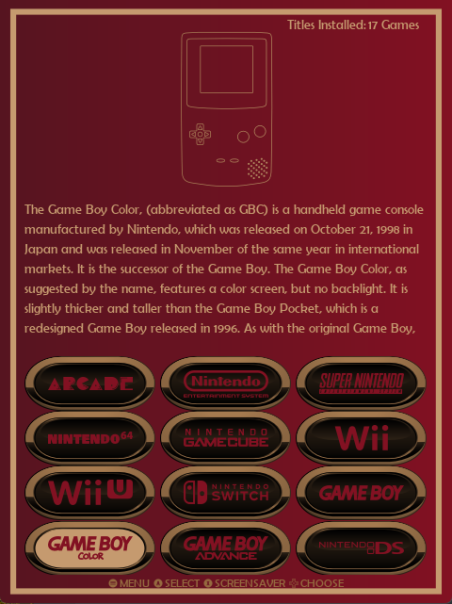
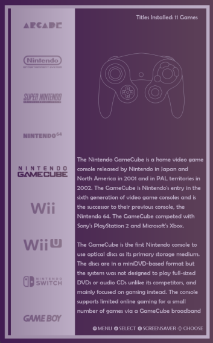
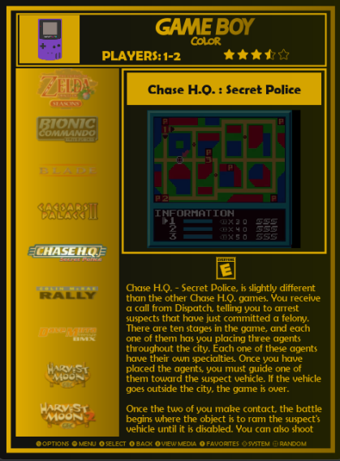
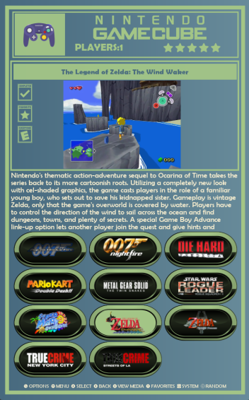

# TateGriddy-es-de for EmulationStation Desktop Edition

Tategriddy is an exclusively TATE theme set for ES-DE that supports all systems as well as the latest application features.

The following options are included:

4 variants:

- Grid with videos
- Grid without videos
- Carousel with videos
- Carousel without videos

8 color schemes:

- Chilled
- Gold
- Greyscale
- Retro
- Purple Rain
- Primary
- Stay Classy
- Blue

3 aspect ratios:

- 16:9_vertical (9:16)
- 4:3_vertical (3:4)
- 16:10_vertical (10:16)

